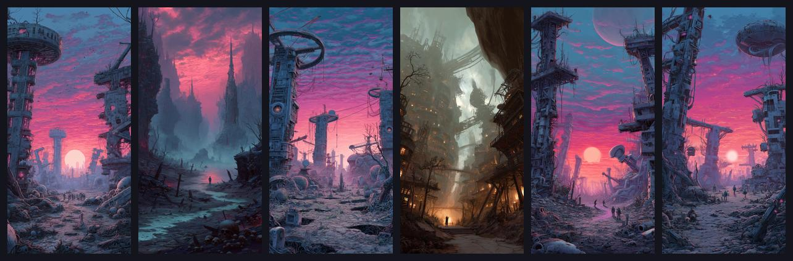
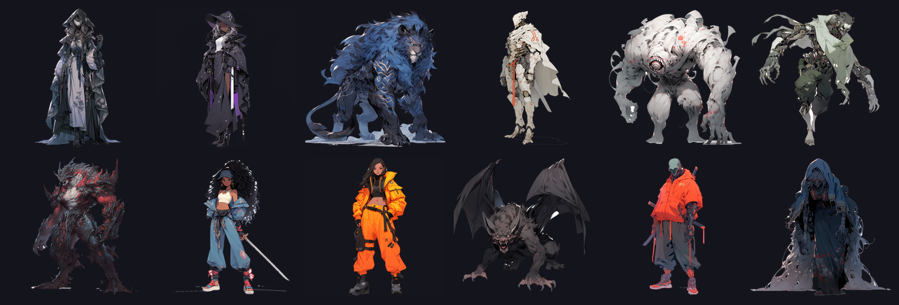

# GridGame2025

The 2025 Unity build of the MindAttic tactical grid RPG: drag heroes into pincer attacks, chain abilities from a shared mana pool, and survive endless enemy waves. Superseded by GridGame2026.

   



There is no build or download. To see it, open the project in the Unity editor (see Quick start).

> We ate through the world like acid. Seeping into the Undearth, trickling ever downward, consuming all we encountered; never sated, never still. Until we met resistance. Dwellers in the dark. A people who had never known war or light. We were interlopers. Invaders from above. A light bearing race corrupting everything in our wake. A poison seeping into cavernous cathedrals, corrupting them into corroded hollows with the light that followed us down into exile.

## Why

- See the middle chapter of the GridGame series, between the first [GridGame](https://github.com/mindattic/GridGame) prototype and [GridGame2026](https://github.com/mindattic/GridGame2026).
- Study a full game loop in Unity: splash, title, profiles, save files, hub, overworld, stage select, battle, post-battle and credits scenes.
- Reuse self-contained systems: sequence-driven turns, pincer detection, a mana pool, an endless wave budget and a Mode 7 style overworld camera.

## Features

- Pincer combat on a grid: drag a hero; when allies trap enemies between them, `PincerAttackManager` and `PincerAttackSequence` resolve the attack, with supporting allies joining through synergy lines.
- Sequences: turns run as queued sequences (hero start, enemy spawn, move, pre-attack, attack, post-attack, end turn, battle won or lost), plus ability sequences such as heal, shield bash, smite, traps and projectiles.
- Shared mana pool: mana grows at the start of each turn, when a hero deals damage and when a hero takes damage (`ManaPoolManager`).
- Endless waves: `EndlessWaveGenerator` spends a points budget that grows each wave, spawns two enemies at wave start, trickles more in every three turns and scales enemy level slowly.
- A large cast: 172 character definitions in `Assets/Scripts/Data/Actor`, with 173 portrait images, plus item and skill libraries.
- Hub between battles: blacksmith, medical, party, residence and shop sections, with tilt parallax.
- Overworld: a hero that follows the cursor across grass, bushes, trees, rocks and clouds with cloud shadows, viewed through a low-angle Mode 7 style camera, with off-screen arrow indicators.
- Profiles, save files, settings, party management, experience tracking and a loading screen.



## Quick start

1. Install Unity 6000.2.1f1 through Unity Hub.
2. Clone the repo and open the folder in Unity Hub.
3. Open `Assets/Scenes/SplashScreen.unity` (or `Game.unity` to jump into battle) and press Play.

```bash
git clone https://github.com/mindattic/GridGame2025.git
```

## Scenes

| Scene | Purpose |
| --- | --- |
| SplashScreen | MindAttic Interactive splash |
| TitleScreen | Title menu |
| ProfileCreate, ProfileSelect, SaveFileSelect | Player profiles and save slots |
| Hub | Blacksmith, medical, party, residence and shop |
| Overworld | Free-roaming map with the Mode 7 style camera |
| StageSelect | Pick a battle |
| Game | The grid battle |
| PostBattleScreen | Results and experience |
| PartyManager | Party setup |
| Settings, LoadingScreen, Credits | Supporting screens |

## How it works

```text
GameManager
  |-- TurnManager --> SequenceManager --> queued sequences
  |                                       HeroStart, EnemySpawn, EnemyMove,
  |                                       EnemyAttack, PincerAttack, EndTurn, ...
  |-- SelectionManager / InputManager --> drag hero on the board
  |-- PincerAttackManager --> SynergyLineManager (supporting allies)
  |-- ManaPoolManager, AbilityManager, ProjectileManager
  |-- EnemyManager <-- EndlessWaveGenerator (budget per wave)
  `-- StageManager, BoardManager, TileManager, PortraitManager, AudioManager
```

## Project layout

```text
Assets/
  Scenes/                      14 scenes, from SplashScreen to Credits
  Scripts/
    Managers/                  game systems (turns, pincer, mana, waves, ...)
    Sequences/                 turn and ability sequences
    Data/                      Actor/ (172 characters), Items/, Skills/
    Hub/, Overworld/, Inventory/
    Canvas/, Instances/, Models/, Effects/, Utilities/, Serialization/
  Sprites/                     portraits, backgrounds, GUI, splash art
  Maps/, Textures/, Animations/
Backup.ps1, Export.ps1         helper scripts: dated project backup, export all .cs into one text file
```

## Limitations

- Unfinished prototype: there is no release build, and parts of the art and VFX folders are marked WIP.
- Development continued in [GridGame2026](https://github.com/mindattic/GridGame2026), which has the current design documents.

## Documentation

This repo has no docs folder. The current design for the series lives in [GridGame2026](https://github.com/mindattic/GridGame2026).

## License

This repo has no LICENSE file. All rights reserved.

Part of [MindAttic](https://mindattic.com) — see more projects at [github.com/mindattic](https://github.com/mindattic). Related: [GridGame](https://github.com/mindattic/GridGame), [GridGame2026](https://github.com/mindattic/GridGame2026), [BattleTrinity](https://github.com/mindattic/BattleTrinity).
